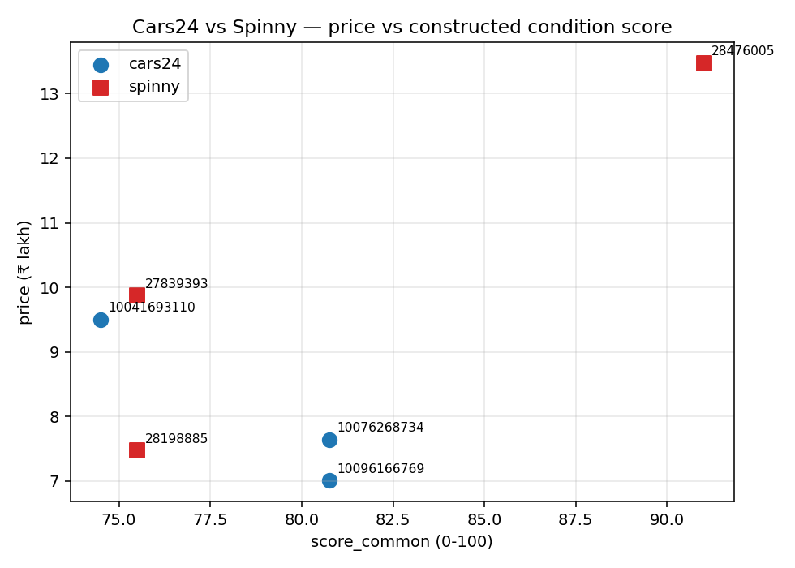

# Cars24 vs Spinny — Competitive Intel

A multi-agent pipeline that extracts specs and condition signals from used-car listings on Cars24 and Spinny, then ranks them by price-to-condition. **Scope: Hyundai Creta, Delhi-NCR, SX trim line, petrol, automatic.** N=6 listings ranked, 3 per platform; 17 additional gold listings hand-labeled for evaluation.

## Why this scope

Ranking only means something between comparable cars. Make, trim, fuel, and transmission each carry their own market premiums — a diesel automatic SX (O) is structurally more expensive than a petrol manual EX, and that gap has nothing to do with car *condition*. Mixing them in the same comparison silently bakes those premiums into the price-to-condition ratio.

The right scope for a small-N comparison is therefore a tight filter: same model, same region, same trim band, same fuel, same transmission. We then score on the remaining quantitative dimensions (km, age, owners, accident).

The honest scale-up — hedonic regression on a 5,000+ listing corpus — would let us drop the matching constraint by *modelling* the price effect of each spec instead of filtering it out. See [`docs/technical_appendix.md` §6](docs/technical_appendix.md#6-with-a-market-corpus-this-would-be-a-different-problem) for the full approach.

## Ranking

Lower ₹ per condition-point = more car for your money.

| # | listing | platform | price | condition score | ₹ per condition-point |
|---|---|---|---:|---:|---:|
| 1 | 10096166769 | cars24 | 7.00L | 48.5 | **14,441** |
| 2 | 10126364760 | cars24 | 5.09L | 34.0 | 14,962 |
| 3 | 10067090111 | cars24 | 10.80L | 68.0 | 15,882 |
| 4 | 28476005 | spinny | 13.47L | 80.0 | 16,838 |
| 5 | 28198885 | spinny | 7.47L | 34.5 | 21,652 |
| 6 | 27839393 | spinny | 9.87L | 35.0 | 28,200 |

## How condition is scored

We score on the four fields **both** Cars24 and Spinny expose for every listing (anything else would advantage the more verbose platform on data quantity rather than on car condition).

| Feature | Why it matters | Weight |
|---|---|---:|
| Kilometres driven | Strongest single predictor of mechanical wear and resale value | 35% |
| Age (years) | Wear is roughly time-driven; affects warranty and parts availability | 25% |
| Number of prior owners | More owners = more variability in maintenance history; first-owner cars carry a market premium | 25% |
| Accident disclosed | Safety / structural signal; weighted lower because the data is coarse (usually yes/no, not severity) | 15% |

For each of the four features, we **rank the 6 cars among themselves** — the best gets 100, the worst gets 0, the rest fall in between by their position. Then we combine the per-feature scores using the weights above to get the condition score.

Why ranks rather than absolute thresholds (e.g. "<20k km is excellent")? Thresholds would be a guess we couldn't defend with data. Ranks come straight from the listings; they don't need defending.

## How we know the ranking holds up

Before producing the ranking we built a small evaluation harness and ran it against a hand-labeled gold dataset of **17 separate listings (7 Cars24 + 10 Spinny)** — all matching the same SX-petrol-automatic filter, all distinct from the 6 listings being ranked above.

- **Faithfulness check** *(on the 17 gold listings).* We hand-labeled each one by reading the source page directly, then ran the extractor and compared. **The extractor matched our values on every field, on both platforms.**
- **Stability check** *(on the 6 ranked listings).* We bumped each of the four weights up and down by 25% (one at a time, 8 variants) and re-ran the ranking. **Kendall's τ stayed between 0.87 and 1.0** — the ranking is not sensitive to small weight choices.
- **Dominance check** *(on the 6 ranked listings).* We dropped each feature in turn and re-ran. **Removing km drops τ to 0.60; the others stay 0.73-0.87.** Kilometres has the strongest single influence on the ranking, but no feature alone determines it.

The pipeline is deterministic by construction (no LLM, no async, no randomness), so output is byte-stable across re-runs without needing a separate check.

**Honest framing on the faithfulness check.** Our hand-labels were read from the same source pages the extractor parses (the platforms inject their listing data as inline JSON, and we read that JSON manually). So the check confirms *the extractor faithfully captures what the page exposes*, not that our scoring formula matches some external valuation. An independent calibration would need either gut-rated condition labels (subjective) or a third-party valuation source — out of scope here, called out below.

## Caveats

- **N=6 is illustrative, not statistically defensible.** Conclusions about platforms shouldn't rest on this alone.
- **Public data only.** With auth/API access we'd use Spinny's 200-point inspection report and Cars24's deeper in-app fields. The fair comparison given pre-auth data is on the fields both platforms expose.
- **Trim line still spans SX / SX PLUS / SX (O).** These are different sub-trims of the SX family with their own MSRP differences. Tightening to a single sub-trim (e.g. just SX (O)) wouldn't give us enough listings on both platforms to fill the 6 ranked + 17 gold we needed; the SX-line filter is the closest workable compromise.
- **Rank-based scoring is set-relative.** A score of 70 means roughly the second-best of 6 *in this set*, not "this car is in 70% condition" in any absolute sense.
- **E3 calibration is a self-consistency check**, not an independent calibration. Independent calibration would need holistic gut-rated gold or third-party valuation.

## Further reading

- [`docs/extraction_review.md`](docs/extraction_review.md) — every listing collected (R = ranking, G = gold, X = excluded by the tight filter), with link to source URL and the four scoring fields read off it. Per-fixture raw + normalized extractions live alongside the snapshot at `fixtures/<platform>/<id>/{page.html, url.txt, captured_at.txt, extracted.json, normalized.json}`.
- [`docs/technical_appendix.md`](docs/technical_appendix.md) — methodology, per-feature rank breakdown, pairwise win matrices, full eval numbers, the platform-positioning side observation, the corpus-scale (hedonic regression) view.
- [`docs/tradeoffs.md`](docs/tradeoffs.md) — engineering tradeoffs journal (schema reality-check, anchored bands → rank-based scoring, tight scope filter).
