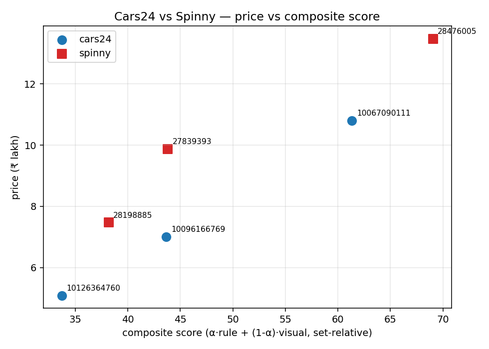

# Cars24 vs Spinny — Competitive Intel

**Scope:** Hyundai Creta SX trim line, Delhi-NCR, petrol, automatic. 6 listings ranked (3 per platform), validated against 10 hand-labeled gold listings. This is a demo project on a single category — not a production system.

---

## TL;DR — Ranking

Each listing gets a **composite score** (0–100, higher = better condition relative to this set) blending two signals in a 70/30 ratio: a **rule signal** derived from kilometres driven, vehicle age, number of prior owners, and accident disclosures, and a **vision signal** from a Claude-with-vision agent that inspects listing photos across five condition aspects (exterior panels, interior cabin, dashboard, tyres, engine bay). Both scores are set-relative rank positions within the full 16-listing benchmark, not absolute condition ratings. Cars24 supplies ~50 showroom-style photos per listing; Spinny supplies ~13 inspection-style photos — engine bay is imputed for Cars24 listings since they don't photograph that area.

| Rank | Listing ID | Platform | Price (₹L) | Composite Score |
|-----:|------------|----------|------------|-----------------|
| 1 | 28476005 | Spinny | 13.47 | 69.05 |
| 2 | 10067090111 | Cars24 | 10.80 | 61.35 |
| 3 | 27839393 | Spinny | 9.87 | 43.82 |
| 4 | 10096166769 | Cars24 | 7.00 | 43.67 |
| 5 | 28198885 | Spinny | 7.47 | 38.17 |
| 6 | 10126364760 | Cars24 | 5.09 | 33.72 |

*Price (₹L) vs composite score. Lower-left is the value zone.*

---

## Why trust it

- **Set-relative scoring.** Every score is a rank within the 16-listing benchmark pool, so scores are comparable within this set but not portable outside it.
- **Held-out evaluation.** The 6 listings ranked above were never used to tune anything. All calibration happened on a separate 10-listing labeled set (5 Cars24 + 5 Spinny).
- **Robust to blend choice.** Sweeping the 70/30 rule-to-vision blend across the full range (50/50 through 100/0) produces Kendall τ ≥ 0.91 against the baseline ranking. The top listing is identical at every blend tested.

---

## Cost + reproducibility

Total compute spend: ~$5 across all eval runs and the final pipeline. Snapshots are reproducible from disk; vision-agent calls are cached on photo content hash, so re-runs don't re-spend.

---

## Where to dig

- [`docs/technical_appendix.md`](docs/technical_appendix.md) — full pipeline, eval methodology, per-aspect numbers
- [`docs/loom_walkthrough.md`](docs/loom_walkthrough.md) — 3-minute visual walkthrough script
- [`runs/latest_ranking/ranking.json`](runs/latest_ranking/ranking.json) — full ranking JSON with all sub-scores
