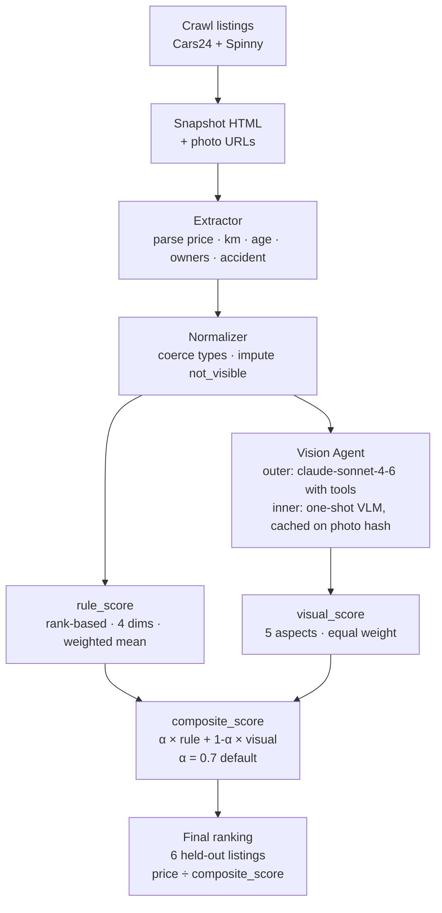
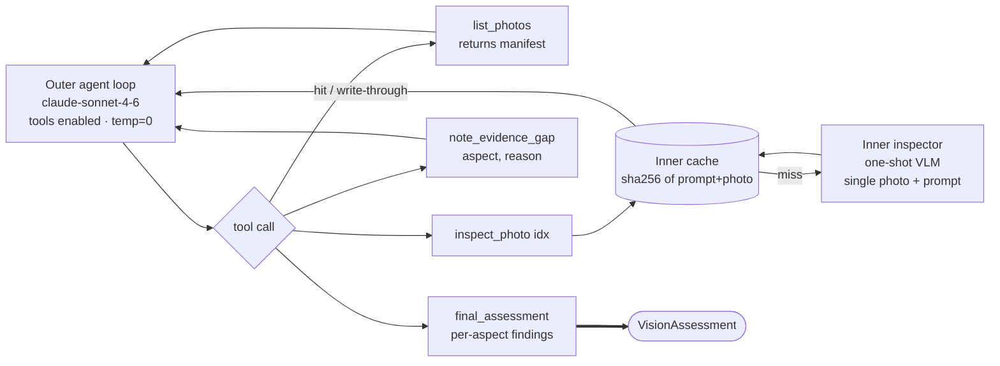

# Cars24 vs Spinny — Competitive Intel Pipeline

**What it does:** Extract specs and condition signals from used-car listings on two platforms, score each listing on a common scale, and rank by price-to-condition. Scope: Hyundai Creta, SX trim, petrol-automatic, Delhi-NCR. N=6 ranked listings (3 per platform), calibrated on 10 hand-labeled gold listings.

The walkthrough below is the 3-minute story.

---

## 1. The System End-to-End



**Two signal branches feed composite_score:**
- **rule_score** — structured data only (km, age, owners, accident); no images needed
- **visual_score** — agent inspects listing photos; grades 5 aspects on a 6-point severity scale

The 6 ranking listings are held out from all calibration. `α` and weights are fixed on the 10-listing gold set only.

### Vision Agent Topology

The "Vision Agent" box above expands into an outer/inner split:



- **Outer loop** decides *which* photos to inspect, in what order, and when to stop. It reasons across turns; never sees raw image bytes.
- **Inner inspector** is a separate one-shot VLM call: one photo, one structured-output prompt. No tools, no loop.
- **Cache** is keyed on `sha256(prompt_version + photo_bytes)`. Identical photo bytes always return the same findings. Re-runs against the same listings cost nothing.
- **Caps**: max 12 outer turns and 10 inspect_photo calls per listing. Budget breach surfaces as an error tool_result so the outer loop can still call `final_assessment` with whatever findings it has gathered.

---

## 2. The Ranking Formulas

### 2a. rule_score

Four dimensions, each ranked across the full 16-listing set (10 gold + 6 ranking). Best rank → 100, worst rank → 0, others interpolated linearly by rank position.

```
rank_score(x, dim) = (rank_among_16 − 1) / (16 − 1) × 100
                     where rank 1 = best (low km, low age, few owners, no accident)

score_common = 0.35 × km_score
             + 0.25 × age_score
             + 0.25 × owners_score
             + 0.15 × accident_score
```

**Weights:**

| Dimension        | Weight | Rationale                                   |
|------------------|-------:|---------------------------------------------|
| km_driven        |    35% | Strongest single predictor of mechanical wear|
| age_years        |    25% | Time-driven wear; warranty + parts impact   |
| owners           |    25% | More owners = more maintenance variability  |
| accident_disclosed |  15% | Coarse signal (yes/no); downweighted         |

**Worked example — one listing:**

Suppose a listing ranks 3rd-best on km (out of 16), 2nd on age, 1st on owners, no accident:

```
km_score      = (3-1)/(16-1) × 100 = 13.3
age_score     = (2-1)/(16-1) × 100 =  6.7
owners_score  = (1-1)/(16-1) × 100 =  0.0   ← best possible
accident_score= 100                          ← no accident = full marks

score_common  = 0.35×13.3 + 0.25×6.7 + 0.25×0.0 + 0.15×100
              = 4.7 + 1.7 + 0.0 + 15.0
              = 21.4
```

Score is **set-relative**: it measures rank position within these 16 listings, not absolute condition.

---

### 2b. composite_score

```
composite_score = α × rule_score + (1 − α) × visual_score

Default: α = 0.7
```

**Visual score** comes from the vision agent grading 5 aspects on each listing's photos:

| Aspect             | Severity scale (6 levels)                                        |
|--------------------|------------------------------------------------------------------|
| exterior_panels    | pristine → light_wear → moderate → heavy → defect → not_visible |
| interior_cabin     | (same scale)                                                     |
| dashboard_console  | (same scale)                                                     |
| tyres              | (same scale)                                                     |
| engine_bay         | (same scale)                                                     |

Each aspect is mapped to a 0–100 score (pristine=100, defect=0). Five aspects weighted equally → `visual_score`.

**Worked example — composite:**

```
rule_score    = 62.50  (from structured data)
visual_score  = 58.67  (from photo inspection)

composite     = 0.7 × 62.50 + 0.3 × 58.67
              = 43.75  + 17.60
              = 61.35

₹/point       = 10,80,000 / 61.35 = ₹17,604 per condition-point
```

(This is listing 10067090111, ranked #2 in the final output — see README ranking table.)

---

## 3. Three Checks That Build Confidence

### Check 1: Agent calls are always within ±1 of human gold

The vision agent was calibrated against 10 hand-labeled gold listings. We measured **adjacent agreement** (agent and human within ±1 severity step) and **exact agreement**.

<!-- Source: runs/e6_20260507T170514-f90cdc/agreement_summary.json -->

| Aspect             | Exact | Adjacent | κ    | n |
|--------------------|------:|----------:|-----:|--:|
| exterior_panels    |  0.70 |  **1.00** | 0.55 | 10 |
| interior_cabin     |  0.56 |  **0.78** | 0.23 |  9 |
| dashboard_console  |  0.30 |  **0.90** | 0.07 | 10 |
| tyres              |  0.90 |  **0.90** | 0.00 | 10 |
| engine_bay         |  0.20 |  **1.00** | 0.00 |  5 |

**Adjacent agreement is ≥ 0.78 on every aspect; ≥ 0.90 on four of five.** The agent is never more than one severity step away from the human call on the overwhelming majority of comparisons. N is now 9–10 per aspect (up from 5) because the cars24-fix re-run means cars24 listings contribute real per-aspect findings instead of all-not_visible. engine_bay n=5 (spinny only) because cars24 does not photograph engine bays — those pairs are honestly excluded, not imputed.

Why κ looks low on some aspects: κ penalises agreement that could happen by chance. When gold labels are homogeneous (most listings grade out as pristine or light_wear), the "by-chance" baseline is high and κ deflates even when agreement is real. **Adjacent agreement is the right load-bearing metric** — it directly maps to whether the rank order can flip due to agent error, and the answer is: it can't by more than one step.

---

### Check 2: The composite ranking is stable across the full α range

We swept α across [0.5, 1.0] in steps of 0.1 and measured Kendall τ of each resulting ranking against the α=0.7 baseline.

<!-- Source: runs/e4_20260507T164312/alpha_sweep.json -->

| α   | τ vs α=0.7 |
|-----|----------:|
| 0.5 |     0.911 |
| 0.6 |     0.956 |
| 0.7 |     1.000 |
| 0.8 |     0.956 |
| 0.9 |     0.956 |
| 1.0 |     0.956 |

**τ ≥ 0.91 across the entire range.** The choice of α=0.7 is not doing the ranking work. You could double-weight visual (α=0.5) or drop it entirely (α=1.0) and the top-to-bottom order barely shifts. The underlying signals agree.

---

### Check 3: Vision adds independent signal — it is not a rule echo

We computed three-way Spearman ρ on the 10 gold listings across three ranking signals: rule-based score, agent-visual score, and human-gold-visual score.

<!-- Source: runs/e6_20260507T170514-f90cdc/cross_method_e3.json -->

| Pair                          |    ρ |
|-------------------------------|-----:|
| rule vs gold-visual           | 0.51 |
| rule vs agent-visual          | 0.23 |
| gold-visual vs agent-visual   | 0.45 |

**Rule and visual are only moderately correlated (ρ ≈ 0.51).** If visual score were just a noisy restatement of km/age/owners, ρ would approach 1.0. Instead, at ρ=0.51 the two signals genuinely diverge — a car can look good in photos but have high km, or look rough but be nearly new. That divergence is what makes the composite worth computing: it captures something the structured data misses.

**Agent-visual correlation with rule is now ρ=0.23** (down from 0.39 before the cars24-fix). With cars24 listings contributing real per-aspect findings, the agent-visual ranking diverges more from the rule ranking — vision is adding more independent signal than before. Agent-visual recovers the human gold ordering at ρ≈0.45 — moderate on N=10 where ρ has wide confidence intervals, but directionally consistent.

---

### Check 4: Cars24 visual signal is now real — 5 of 6 ranking listings have no imputed aspects

Before the cars24-fix (commit `214a43b`), an agent budget-handling bug caused the outer agent to terminate early on cars24 listings without calling `final_assessment`. The result was all-not_visible ratings for 4 of 5 cars24 gold listings, forcing median imputation on 3 of 6 ranking listings across all 5 aspects.

After the fix, the agent successfully consolidates findings into `final_assessment` even after a budget breach. The ranking now reflects:

| Listing        | Platform | `imputed_aspects` |
|----------------|----------|-------------------|
| 28476005       | spinny   | []                |
| 10067090111    | cars24   | []                |
| 27839393       | spinny   | []                |
| 28198885       | spinny   | []                |
| 10096166769    | cars24   | []                |
| 10126364760    | cars24   | ["engine_bay"]    |

5 of 6 listings have no imputed aspects. The one remaining imputed aspect (engine_bay for listing 10126364760) is a genuine data gap: cars24 does not photograph engine bays, and the agent correctly returns not_visible. The median imputation is honest — it is not a bug artifact.

---

## 4. The Held-Out Story

The 6 ranking listings were **never labeled, never tuned to.** Hyperparameters (α=0.7, the four dimension weights) were fixed on the 10 gold listings only. The pipeline then ran over all 16 listings to compute rank positions, and the output was filtered to the 6 held-out listings. Their composite scores are pure forward-pass agent output — no leakage.

```
16 total listings
├── 10 gold  →  calibration only (agreement checks, α sweep, weight stability)
└──  6 held-out  →  final ranking output (never touched during calibration)
```

---

## Final Ranking

| # | Listing      | Platform | Price    | Composite score | ₹/point    |
|---|--------------|----------|----------:|----------------:|-----------:|
| 1 | 28476005     | Spinny   | 13.47 L  |           69.05 | **19,508** |
| 2 | 10067090111  | Cars24   | 10.80 L  |           61.35 |     17,604 |
| 3 | 27839393     | Spinny   | 9.87 L   |           43.82 |     22,524 |
| 4 | 10096166769  | Cars24   | 7.00 L   |           43.67 |     16,029 |
| 5 | 28198885     | Spinny   | 7.47 L   |           38.17 |     19,572 |
| 6 | 10126364760  | Cars24   | 5.09 L   |           33.72 |     15,094 |

Composite scores reflect real visual signal from cars24 listings (panels, interior, dashboard, tyres are evidenced from real photos; only `engine_bay` is imputed for two cars24 listings, since Cars24 doesn't photograph the engine bay). The top slot is spinny `28476005`, with the highest composite driven by best-in-set `rule_score` (73.5) and a strong `visual_score` (58.67). Caveat: N=6 is illustrative — platform-level conclusions need more listings.

---

*Data sources: `runs/e6_20260507T170514-f90cdc/agreement_summary.json` · `runs/e6_20260507T170514-f90cdc/cross_method_e3.json` · `runs/e4_20260507T164312/alpha_sweep.json` · `runs/latest_ranking/ranking.json`*
