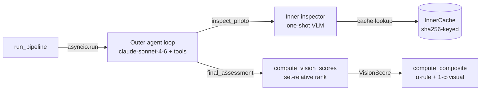

# Plan C — Vision Agent Eval + Reporting

> **For agentic workers:** REQUIRED SUB-SKILL: Use superpowers:subagent-driven-development (recommended) or superpowers:executing-plans to implement this plan task-by-task. Steps use checkbox (`- [ ]`) syntax for tracking.

**Goal:** Validate the vision agent against the 10-listing gold (E6 κ + adjacent), measure determinism (E5), extend cross-method (E3) and sensitivity (E4), and produce the final deliverable: a 16-listing pipeline run with vision ON, README ranking table with `composite_score`, and a technical appendix section walking through the vision agent topology + eval results.

**Architecture:** Four eval modules (vision_agreement, vision_determinism, plus extensions to existing cross_method and sensitivity), one final-run script invocation, and three documentation updates. Reuses existing eval module patterns in `src/ci/eval/`.

**Tech Stack:** Python 3.11+, scipy (existing), pytest. No new deps.

**Spec reference:** `docs/superpowers/specs/2026-05-07-vision-agent-design.md` §12.3-§12.6, §13.

**Locked listing IDs (from Plan A + B):**

```
Gold (calibration, 10):
  cars24:  10017390119, 10041693110, 10142868769, 10182490193, 44546195190
  spinny:  27723929, 27741490, 28240497, 28260532, 28564392

Ranking (held-out, 6):
  cars24:  10067090111, 10096166769, 10126364760
  spinny:  27839393, 28198885, 28476005
```

`eval/vision_gold.jsonl` is hand-labeled for the 10 gold listings.

---

## File structure

**New:**

```
src/ci/eval/
  vision_agreement.py    # E6: per-aspect exact, adjacent, Cohen's κ
  vision_determinism.py  # E5: stability across cold-cache reruns
  cross_method.py        # E3: three-way Spearman rule/gold/agent

scripts/
  run_e6_agreement.py     # invokes agent, compares to gold
  run_e5_determinism.py   # 5 listings × 3 cold runs
  run_e3_crossmethod.py
  run_e4_alpha_sweep.py
```

**Modified:**

```
src/ci/eval/sensitivity.py   # extend with α-sweep dim
docs/technical_appendix.md   # add §"Vision agent topology" section
README.md                    # ranking table → composite_score column
runs/<final-run>/ranking.json  # produced by final pipeline run
```

---

## Task 1: E6 — agent vs gold (κ + adjacent + exact)

**Files:**
- Create: `src/ci/eval/vision_agreement.py`
- Create: `tests/test_eval_vision_agreement.py`
- Create: `scripts/run_e6_agreement.py`

- [ ] **Step 1: Write failing tests**

```python
# tests/test_eval_vision_agreement.py
"""Per-aspect agent-vs-gold metrics: exact, adjacent, Cohen's κ."""
import pytest

from ci.eval.vision_agreement import (
    severity_to_int,
    agreement_metrics,
)


def test_severity_to_int_orders_known_values():
    assert severity_to_int("pristine") == 0
    assert severity_to_int("light_wear") == 1
    assert severity_to_int("moderate") == 2
    assert severity_to_int("heavy") == 3
    assert severity_to_int("defect") == 4
    assert severity_to_int("not_visible") is None


def test_agreement_perfect_match():
    pairs = [("pristine", "pristine"), ("light_wear", "light_wear"),
             ("moderate", "moderate")]
    m = agreement_metrics(pairs)
    assert m["exact"] == 1.0
    assert m["adjacent"] == 1.0
    assert m["kappa"] == pytest.approx(1.0, abs=1e-6)
    assert m["n_compared"] == 3


def test_agreement_off_by_one_is_adjacent_not_exact():
    pairs = [("pristine", "light_wear"), ("light_wear", "moderate")]
    m = agreement_metrics(pairs)
    assert m["exact"] == 0.0
    assert m["adjacent"] == 1.0
    assert m["n_compared"] == 2


def test_agreement_skips_pairs_with_not_visible():
    pairs = [("pristine", "not_visible"), ("light_wear", "light_wear")]
    m = agreement_metrics(pairs)
    # Only the second pair is comparable
    assert m["n_compared"] == 1
    assert m["exact"] == 1.0


def test_agreement_kappa_is_zero_when_random():
    # Constant gold, varied agent → κ ~ 0
    pairs = [("pristine", "pristine"), ("pristine", "light_wear"),
             ("pristine", "moderate"), ("pristine", "pristine")]
    m = agreement_metrics(pairs)
    # When one rater is constant, kappa is undefined or 0; we return 0.0 by convention
    assert m["kappa"] == 0.0
```

- [ ] **Step 2: Run failing**

Run: `uv run pytest tests/test_eval_vision_agreement.py -v`
Expected: ImportError.

- [ ] **Step 3: Implement**

```python
# src/ci/eval/vision_agreement.py
"""E6: per-aspect agreement between agent assessments and gold labels.

Reports three metrics on the ordinal severity scale:
  - exact agreement: agent == gold rate
  - adjacent agreement: |agent - gold| ≤ 1 rate (more stable at small N)
  - Cohen's κ: ordinal-aware kappa (linear weights)

Pairs where either side is "not_visible" are excluded from the comparison —
their gap is honest, not noise.
"""
from __future__ import annotations

from sklearn.metrics import cohen_kappa_score  # noqa: F401

_SEVERITY_ORDER = {
    "pristine": 0, "light_wear": 1, "moderate": 2, "heavy": 3, "defect": 4,
}


def severity_to_int(severity: str) -> int | None:
    return _SEVERITY_ORDER.get(severity)


def _cohen_kappa(agent_ints: list[int], gold_ints: list[int]) -> float:
    """Linear-weighted Cohen's κ. Returns 0.0 if undefined (constant rater)."""
    n = len(agent_ints)
    if n == 0:
        return 0.0
    if len(set(agent_ints)) == 1 or len(set(gold_ints)) == 1:
        return 0.0
    # Manual implementation (avoid sklearn dep): linear-weighted κ
    # κ = 1 - (Σ w_ij * O_ij) / (Σ w_ij * E_ij), weights linear |i-j|/(K-1)
    K = 5
    cats = list(range(K))
    obs = [[0]*K for _ in range(K)]
    for a, g in zip(agent_ints, gold_ints):
        obs[a][g] += 1
    row_marg = [sum(obs[i]) for i in range(K)]
    col_marg = [sum(obs[i][j] for i in range(K)) for j in range(K)]
    weighted_obs = 0.0
    weighted_exp = 0.0
    for i in range(K):
        for j in range(K):
            w = abs(i - j) / (K - 1)
            weighted_obs += w * obs[i][j]
            weighted_exp += w * (row_marg[i] * col_marg[j] / n)
    if weighted_exp == 0:
        return 0.0
    return 1 - (weighted_obs / weighted_exp)


def agreement_metrics(pairs: list[tuple[str, str]]) -> dict:
    """Compute exact / adjacent / kappa from (agent, gold) severity strings.

    `not_visible` on either side excludes that pair from comparison.
    """
    agent_ints = []
    gold_ints = []
    for a, g in pairs:
        ai = severity_to_int(a)
        gi = severity_to_int(g)
        if ai is None or gi is None:
            continue
        agent_ints.append(ai)
        gold_ints.append(gi)

    n = len(agent_ints)
    if n == 0:
        return {"exact": 0.0, "adjacent": 0.0, "kappa": 0.0, "n_compared": 0}

    exact = sum(1 for a, g in zip(agent_ints, gold_ints) if a == g) / n
    adjacent = sum(1 for a, g in zip(agent_ints, gold_ints) if abs(a - g) <= 1) / n
    kappa = _cohen_kappa(agent_ints, gold_ints)
    return {"exact": exact, "adjacent": adjacent, "kappa": kappa, "n_compared": n}
```

(Drop the sklearn import — implementation is manual to avoid the dep.)

- [ ] **Step 4: Tests pass**

Run: `uv run pytest tests/test_eval_vision_agreement.py -v`
Expected: 5 passed.

- [ ] **Step 5: Build the runner script**

```python
# scripts/run_e6_agreement.py
"""Run vision agent against the 10 gold listings, compare to vision_gold.jsonl, report E6.

Outputs:
  - runs/e6_<ts>/agent_assessments.json  (full agent output for each listing)
  - runs/e6_<ts>/agreement_summary.json  (per-aspect, per-platform metrics)
"""
from __future__ import annotations

import asyncio
import json
import uuid
from datetime import datetime, timezone
from pathlib import Path

from ci.config import EVAL_DIR, FIXTURES_DIR, RUNS_DIR
from ci.eval.vision_agreement import agreement_metrics
from ci.vision.agent import run_vision_agent
from ci.vision.cache import InnerCache
from ci.vision.inspector import inspect_photo, INSPECTOR_PROMPT_VERSION
from ci.vision.manifest import read_manifest

ASPECTS = ("exterior_panels", "interior_cabin",
           "dashboard_console", "tyres", "engine_bay")


def load_gold() -> dict[str, dict]:
    out = {}
    for line in (EVAL_DIR / "vision_gold.jsonl").read_text().splitlines():
        if line.startswith("#") or not line.strip():
            continue
        row = json.loads(line)
        out[row["listing_id"]] = row
    return out


async def assess_one(client, cache, platform: str, lid: str) -> dict | None:
    manifest_path = FIXTURES_DIR / platform / lid / "photos.json"
    manifest = read_manifest(manifest_path)
    if not manifest or not manifest.get("photos"):
        return None

    async def inspector_fn(idx: int) -> dict:
        entry = next((p for p in manifest["photos"] if p["idx"] == idx), None)
        if entry is None:
            return {"aspects_visible": [], "findings": {}}
        photo_path = FIXTURES_DIR / platform / lid / "photos" / f"{entry['sha256']}.jpg"
        if not photo_path.exists():
            return {"aspects_visible": [], "findings": {}}
        return await inspect_photo(
            photo_path=photo_path, photo_sha=entry["sha256"],
            client=client, cache=cache,
        )

    return await run_vision_agent(
        listing_id=lid, platform=platform,
        manifest=manifest, client=client, inspector_fn=inspector_fn,
    )


async def main_async():
    from anthropic import AsyncAnthropic
    client = AsyncAnthropic()
    cache_root = Path("runs/.cache/vision")
    cache = InnerCache(root=cache_root, prompt_version=INSPECTOR_PROMPT_VERSION)

    gold = load_gold()
    targets = [(g["platform"], g["listing_id"]) for g in gold.values()]

    print(f"Running agent on {len(targets)} listings...")
    results = await asyncio.gather(*(assess_one(client, cache, p, l) for p, l in targets))

    by_id = {a.listing_id: a for a in results if a is not None}
    print(f"Got {len(by_id)} assessments")

    # Per aspect, per platform metrics
    per_aspect: dict = {}
    per_aspect_per_platform: dict = {}
    for aspect in ASPECTS:
        pairs = []
        plat_pairs: dict[str, list[tuple[str, str]]] = {}
        for lid, g_row in gold.items():
            assessment = by_id.get(lid)
            gold_sev = g_row["vision_gold"][aspect]
            if assessment is None or gold_sev is None:
                continue
            agent_finding = next(
                (f.severity for f in assessment.findings if f.aspect == aspect),
                "not_visible",
            )
            pairs.append((agent_finding, gold_sev))
            plat_pairs.setdefault(g_row["platform"], []).append((agent_finding, gold_sev))

        per_aspect[aspect] = agreement_metrics(pairs)
        per_aspect_per_platform[aspect] = {
            p: agreement_metrics(pp) for p, pp in plat_pairs.items()
        }

    summary = {
        "n_listings": len(by_id),
        "per_aspect": per_aspect,
        "per_aspect_per_platform": per_aspect_per_platform,
    }

    run_id = "e6_" + datetime.now(timezone.utc).strftime("%Y%m%dT%H%M%S") + "-" + uuid.uuid4().hex[:6]
    run_dir = RUNS_DIR / run_id
    run_dir.mkdir(parents=True, exist_ok=True)

    (run_dir / "agent_assessments.json").write_text(
        json.dumps([a.model_dump() for a in by_id.values()], indent=2)
    )
    (run_dir / "agreement_summary.json").write_text(json.dumps(summary, indent=2))
    print(f"Wrote {run_dir}/agreement_summary.json")
    print(json.dumps(summary, indent=2))


def main():
    asyncio.run(main_async())


if __name__ == "__main__":
    main()
```

- [ ] **Step 6: Run E6**

Run: `uv run python -m scripts.run_e6_agreement`

Expected: prints assessments count + summary JSON. Cost ~$0.50 (10 listings × ~6 turns × inner inspections).

- [ ] **Step 7: Commit**

```bash
git add src/ci/eval/vision_agreement.py tests/test_eval_vision_agreement.py scripts/run_e6_agreement.py
git commit -m "feat(eval): E6 vision-agent agreement metrics + runner"
```

---

## Task 2: E5 — vision determinism (5 listings × 3 cold runs)

**Files:**
- Create: `src/ci/eval/vision_determinism.py`
- Create: `tests/test_eval_vision_determinism.py`
- Create: `scripts/run_e5_determinism.py`

- [ ] **Step 1: Write failing tests**

```python
# tests/test_eval_vision_determinism.py
from ci.eval.vision_determinism import determinism_metrics


def test_three_identical_runs_score_exact_1_adjacent_1_range_0():
    runs = [
        {"L1": {"exterior_panels": "pristine"}},
        {"L1": {"exterior_panels": "pristine"}},
        {"L1": {"exterior_panels": "pristine"}},
    ]
    visual_scores = [{"L1": 50.0}, {"L1": 50.0}, {"L1": 50.0}]
    m = determinism_metrics(runs, visual_scores)
    assert m["exact"]["exterior_panels"] == 1.0
    assert m["adjacent"]["exterior_panels"] == 1.0
    assert m["per_listing_score_range"]["L1"] == 0.0


def test_off_by_one_across_runs_adjacent_1_exact_0():
    runs = [
        {"L1": {"exterior_panels": "pristine"}},
        {"L1": {"exterior_panels": "light_wear"}},
        {"L1": {"exterior_panels": "pristine"}},
    ]
    visual_scores = [{"L1": 50.0}, {"L1": 50.0}, {"L1": 50.0}]
    m = determinism_metrics(runs, visual_scores)
    assert m["exact"]["exterior_panels"] == 0.0
    # 2 of 3 pairwise comparisons are adjacent (within 1)
    assert m["adjacent"]["exterior_panels"] == 1.0
```

- [ ] **Step 2: Implement**

```python
# src/ci/eval/vision_determinism.py
"""E5: stability of vision agent across cold-cache reruns.

For each aspect: exact-agreement and adjacent-agreement rates across N runs.
For each listing: visual_score range (max - min).
"""
from __future__ import annotations

from itertools import combinations

_SEVERITY_ORDER = {
    "pristine": 0, "light_wear": 1, "moderate": 2, "heavy": 3, "defect": 4,
    "not_visible": None,
}


def _to_int(s: str) -> int | None:
    return _SEVERITY_ORDER.get(s)


def determinism_metrics(
    runs: list[dict[str, dict[str, str]]],
    visual_scores: list[dict[str, float]],
) -> dict:
    """Each run is {listing_id: {aspect: severity}}. visual_scores parallel list of {listing_id: score}."""
    if not runs:
        return {"exact": {}, "adjacent": {}, "per_listing_score_range": {}}

    aspects = set()
    for r in runs:
        for asp_map in r.values():
            aspects.update(asp_map.keys())

    listings = set()
    for r in runs:
        listings.update(r.keys())

    exact_per_aspect = {}
    adjacent_per_aspect = {}
    for aspect in sorted(aspects):
        ex_hits = ex_total = 0
        adj_hits = adj_total = 0
        for lid in listings:
            severities = [r.get(lid, {}).get(aspect) for r in runs]
            ints = [_to_int(s) if s else None for s in severities]
            valid = [i for i in ints if i is not None]
            if len(valid) < 2:
                continue
            for a, b in combinations(valid, 2):
                ex_total += 1
                adj_total += 1
                if a == b:
                    ex_hits += 1
                if abs(a - b) <= 1:
                    adj_hits += 1
        exact_per_aspect[aspect] = ex_hits / ex_total if ex_total else 0.0
        adjacent_per_aspect[aspect] = adj_hits / adj_total if adj_total else 0.0

    per_listing_score_range = {}
    for lid in listings:
        scores = [vs.get(lid) for vs in visual_scores if vs.get(lid) is not None]
        if scores:
            per_listing_score_range[lid] = max(scores) - min(scores)
        else:
            per_listing_score_range[lid] = 0.0

    return {
        "exact": exact_per_aspect,
        "adjacent": adjacent_per_aspect,
        "per_listing_score_range": per_listing_score_range,
    }
```

- [ ] **Step 3: Tests pass**

Run: `uv run pytest tests/test_eval_vision_determinism.py -v`
Expected: 2 passed.

- [ ] **Step 4: Build runner**

```python
# scripts/run_e5_determinism.py
"""E5: 5 listings × 3 cold-cache runs of the vision agent. Reports per-aspect stability.

Picks 5 listings from the 10-gold subset (never from the 6 ranking, per spec §12.4).
"""
from __future__ import annotations

import asyncio
import json
import uuid
from datetime import datetime, timezone
from pathlib import Path

from ci.config import EVAL_DIR, FIXTURES_DIR, RUNS_DIR
from ci.eval.vision_determinism import determinism_metrics
from ci.vision.agent import run_vision_agent
from ci.vision.cache import InnerCache
from ci.vision.inspector import inspect_photo, INSPECTOR_PROMPT_VERSION
from ci.vision.manifest import read_manifest
from ci.vision.score import compute_vision_scores


def gold_listings():
    out = []
    for line in (EVAL_DIR / "gold.jsonl").read_text().splitlines():
        if line.strip():
            r = json.loads(line)
            out.append((r["platform"], r["listing_id"]))
    return out


async def run_once(targets, run_idx):
    from anthropic import AsyncAnthropic
    client = AsyncAnthropic()
    # Cold cache for each run — bypass=True
    cache = InnerCache(root=Path(f"runs/.cache/vision_e5_run{run_idx}"),
                       prompt_version=INSPECTOR_PROMPT_VERSION, bypass=True)
    assessments = []
    for platform, lid in targets:
        manifest_path = FIXTURES_DIR / platform / lid / "photos.json"
        manifest = read_manifest(manifest_path)
        if not manifest:
            continue

        async def inspector_fn(idx, _platform=platform, _lid=lid, _m=manifest):
            entry = next((p for p in _m["photos"] if p["idx"] == idx), None)
            if entry is None:
                return {"aspects_visible": [], "findings": {}}
            photo_path = FIXTURES_DIR / _platform / _lid / "photos" / f"{entry['sha256']}.jpg"
            return await inspect_photo(
                photo_path=photo_path, photo_sha=entry["sha256"],
                client=client, cache=cache,
            )

        a = await run_vision_agent(
            listing_id=lid, platform=platform,
            manifest=manifest, client=client, inspector_fn=inspector_fn,
        )
        assessments.append(a)
    return assessments


async def main_async():
    targets = gold_listings()[:5]
    runs_severities = []
    runs_visual_scores = []
    for i in range(3):
        print(f"--- run {i+1}/3 ---")
        assessments = await run_once(targets, i)
        sev_map = {a.listing_id: {f.aspect: f.severity for f in a.findings} for a in assessments}
        runs_severities.append(sev_map)
        scores = compute_vision_scores(assessments)
        runs_visual_scores.append({s.listing_id: s.visual_score for s in scores})

    metrics = determinism_metrics(runs_severities, runs_visual_scores)

    run_id = "e5_" + datetime.now(timezone.utc).strftime("%Y%m%dT%H%M%S") + "-" + uuid.uuid4().hex[:6]
    run_dir = RUNS_DIR / run_id
    run_dir.mkdir(parents=True, exist_ok=True)
    (run_dir / "determinism_summary.json").write_text(json.dumps({
        "n_listings": len(targets),
        "n_runs": 3,
        "metrics": metrics,
    }, indent=2))
    print(json.dumps(metrics, indent=2))
    print(f"Wrote {run_dir}/determinism_summary.json")


def main():
    asyncio.run(main_async())


if __name__ == "__main__":
    main()
```

- [ ] **Step 5: Run E5** (cost ~$1.50 — 5 × 3 × ~5 photo inspections)

Run: `uv run python -m scripts.run_e5_determinism`

- [ ] **Step 6: Commit**

```bash
git add src/ci/eval/vision_determinism.py tests/test_eval_vision_determinism.py scripts/run_e5_determinism.py
git commit -m "feat(eval): E5 vision determinism over 5 listings × 3 cold runs"
```

---

## Task 3: E3 — three-way cross-method (rule / gold-visual / agent-visual)

**Files:**
- Create: `src/ci/eval/cross_method.py`
- Create: `tests/test_eval_cross_method.py`
- Create: `scripts/run_e3_crossmethod.py`

- [ ] **Step 1: Failing tests**

```python
# tests/test_eval_cross_method.py
from ci.eval.cross_method import three_way_spearman


def test_three_way_returns_pairwise_rhos():
    rule = {"A": 80, "B": 50, "C": 30}
    gold_v = {"A": 80, "B": 50, "C": 30}  # identical to rule
    agent_v = {"A": 30, "B": 50, "C": 80}  # reversed
    out = three_way_spearman(rule, gold_v, agent_v)
    assert "rule_vs_gold_visual" in out
    assert "rule_vs_agent_visual" in out
    assert "gold_visual_vs_agent_visual" in out
    assert out["rule_vs_gold_visual"] == 1.0  # perfect
    assert out["rule_vs_agent_visual"] < 0  # reversed
```

- [ ] **Step 2: Implement**

```python
# src/ci/eval/cross_method.py
"""E3: pairwise Spearman rank correlations across three signals.

Inputs are dicts {listing_id: score}. Listing IDs must match across all three.
"""
from __future__ import annotations

from scipy.stats import spearmanr


def three_way_spearman(
    rule_scores: dict[str, float],
    gold_visual_scores: dict[str, float],
    agent_visual_scores: dict[str, float],
) -> dict[str, float]:
    common = sorted(set(rule_scores) & set(gold_visual_scores) & set(agent_visual_scores))
    if len(common) < 2:
        return {
            "rule_vs_gold_visual": 0.0,
            "rule_vs_agent_visual": 0.0,
            "gold_visual_vs_agent_visual": 0.0,
            "n": len(common),
        }
    rule = [rule_scores[lid] for lid in common]
    gold = [gold_visual_scores[lid] for lid in common]
    agent = [agent_visual_scores[lid] for lid in common]

    return {
        "rule_vs_gold_visual": float(spearmanr(rule, gold).correlation),
        "rule_vs_agent_visual": float(spearmanr(rule, agent).correlation),
        "gold_visual_vs_agent_visual": float(spearmanr(gold, agent).correlation),
        "n": len(common),
    }
```

- [ ] **Step 3: Tests pass**

Run: `uv run pytest tests/test_eval_cross_method.py -v`

- [ ] **Step 4: Build runner**

```python
# scripts/run_e3_crossmethod.py
"""E3: three-way Spearman on the 10 gold listings. Uses E6's agent assessments.

Reuses the latest runs/e6_*/agent_assessments.json. Run E6 first.
"""
from __future__ import annotations

import glob
import json
from pathlib import Path

from ci.config import EVAL_DIR, RUNS_DIR
from ci.eval.cross_method import three_way_spearman
from ci.schemas import VisionAssessment, VisionFinding
from ci.vision.score import compute_vision_scores


def main():
    # Load gold rule_scores
    gold_rule = {}
    for line in (EVAL_DIR / "gold.jsonl").read_text().splitlines():
        if line.strip():
            r = json.loads(line)
            gold_rule[r["listing_id"]] = r["score_common"]

    # Load gold-visual: build VisionAssessments from vision_gold.jsonl, score them
    gold_assessments = []
    for line in (EVAL_DIR / "vision_gold.jsonl").read_text().splitlines():
        if line.startswith("#") or not line.strip():
            continue
        r = json.loads(line)
        findings = [
            VisionFinding(
                aspect=a, severity=r["vision_gold"][a],
                confidence="high", photo_refs=[], evidence_note="",
            )
            for a in r["vision_gold"]
        ]
        gold_assessments.append(VisionAssessment(
            listing_id=r["listing_id"], platform=r["platform"],
            findings=findings, photos_inspected=[],
            photo_count_total=0, agent_turns=0,
        ))
    gold_visual = {s.listing_id: s.visual_score for s in compute_vision_scores(gold_assessments)}

    # Load agent assessments from latest E6 run
    paths = sorted(glob.glob(str(RUNS_DIR / "e6_*/agent_assessments.json")))
    if not paths:
        raise SystemExit("Run E6 first (no runs/e6_*/agent_assessments.json found)")
    latest = paths[-1]
    print(f"Using agent assessments from {latest}")
    agent_data = json.loads(Path(latest).read_text())
    agent_assessments = [VisionAssessment.model_validate(d) for d in agent_data]
    agent_visual = {s.listing_id: s.visual_score for s in compute_vision_scores(agent_assessments)}

    out = three_way_spearman(gold_rule, gold_visual, agent_visual)
    print(json.dumps(out, indent=2))

    # Persist
    parent = Path(latest).parent
    (parent / "cross_method_e3.json").write_text(json.dumps(out, indent=2))
    print(f"Wrote {parent}/cross_method_e3.json")


if __name__ == "__main__":
    main()
```

- [ ] **Step 5: Run + commit**

Run: `uv run python -m scripts.run_e3_crossmethod`

```bash
git add src/ci/eval/cross_method.py tests/test_eval_cross_method.py scripts/run_e3_crossmethod.py
git commit -m "feat(eval): E3 three-way Spearman (rule / gold-visual / agent-visual)"
```

---

## Task 4: E4 — α + weights joint sweep

**Files:**
- Create: `scripts/run_e4_alpha_sweep.py`

This task reuses the existing `weight_sensitivity` and `compute_composite`. The runner does the joint sweep externally.

- [ ] **Step 1: Build runner**

```python
# scripts/run_e4_alpha_sweep.py
"""E4: weights × α joint sweep on the 10 gold listings.

For each α in {0.5, 0.6, 0.7, 0.8, 0.9, 1.0}, compose with each weight perturbation
and measure rank stability against α=0.7 baseline. Uses gold-visual as the visual signal
(so the result is calibration stability, not contaminated by agent variance).
"""
from __future__ import annotations

import json
from datetime import datetime, timezone
from pathlib import Path

from scipy.stats import kendalltau

from ci.config import EVAL_DIR, RUNS_DIR
from ci.normalize import normalize
from ci.schemas import RawListing, VisionAssessment, VisionFinding
from ci.score import score_listings
from ci.vision.composite import compute_composite
from ci.vision.score import compute_vision_scores


def _load_gold():
    rows = []
    for line in (EVAL_DIR / "gold.jsonl").read_text().splitlines():
        if line.strip():
            rows.append(json.loads(line))
    return rows


def _load_vision_gold():
    rows = []
    for line in (EVAL_DIR / "vision_gold.jsonl").read_text().splitlines():
        if not line.startswith("#") and line.strip():
            rows.append(json.loads(line))
    return rows


def main():
    gold = _load_gold()
    norms = []
    for r in gold:
        norms.append(normalize(
            RawListing(
                platform=r["platform"], listing_id=r["listing_id"],
                url="gold://", captured_at="gold", fields=r["full_fields"],
            ),
            today_year=2026,
        ))
    rule_scores = {s.listing_id: s.score_common for s in score_listings(norms)}

    vg = _load_vision_gold()
    gold_assessments = [
        VisionAssessment(
            listing_id=r["listing_id"], platform=r["platform"],
            findings=[
                VisionFinding(aspect=a, severity=r["vision_gold"][a],
                              confidence="high", photo_refs=[], evidence_note="")
                for a in r["vision_gold"]
            ],
            photos_inspected=[], photo_count_total=0, agent_turns=0,
        )
        for r in vg
    ]
    visual_scores = {s.listing_id: s.visual_score for s in compute_vision_scores(gold_assessments)}

    alphas = [0.5, 0.6, 0.7, 0.8, 0.9, 1.0]
    rankings_by_alpha = {}
    for a in alphas:
        composites = {
            lid: compute_composite(rule_score=rule_scores[lid],
                                    visual_score=visual_scores[lid], alpha=a)
            for lid in rule_scores
        }
        order = sorted(composites, key=lambda lid: composites[lid], reverse=True)
        rankings_by_alpha[a] = order

    # Kendall tau between α=0.7 baseline and each other α
    base = rankings_by_alpha[0.7]
    base_pos = {lid: i for i, lid in enumerate(base)}
    tau_by_alpha = {}
    for a, order in rankings_by_alpha.items():
        if a == 0.7:
            tau_by_alpha[a] = 1.0
            continue
        other_pos = {lid: i for i, lid in enumerate(order)}
        xs = [base_pos[lid] for lid in base]
        ys = [other_pos[lid] for lid in base]
        tau, _ = kendalltau(xs, ys)
        tau_by_alpha[a] = float(tau)

    summary = {
        "alphas": alphas,
        "ranking_by_alpha": rankings_by_alpha,
        "kendall_tau_vs_alpha_0_7": tau_by_alpha,
    }

    run_id = "e4_" + datetime.now(timezone.utc).strftime("%Y%m%dT%H%M%S")
    run_dir = RUNS_DIR / run_id
    run_dir.mkdir(parents=True, exist_ok=True)
    (run_dir / "alpha_sweep.json").write_text(json.dumps(summary, indent=2))
    print(json.dumps(summary, indent=2))
    print(f"Wrote {run_dir}/alpha_sweep.json")


if __name__ == "__main__":
    main()
```

- [ ] **Step 2: Run + commit**

Run: `uv run python -m scripts.run_e4_alpha_sweep`

```bash
git add scripts/run_e4_alpha_sweep.py
git commit -m "feat(eval): E4 alpha sweep on 10 gold (composite stability vs α=0.7 baseline)"
```

---

## Task 5: Final pipeline run (16 listings, vision ON, alpha=0.7)

This produces the deliverable ranking that goes in the README.

- [ ] **Step 1: Run**

```bash
set -a && source .env && set +a
uv run python -m scripts.run_pipeline
```

(No --vision-listings flag → vision runs on all 16; cache hits inner inspections from E6 run.)

Expected: `wrote runs/<ts>/ranking.json` with 6 rows (the held-out ranking subset), each with `rule_score`, `visual_score`, `composite_score`, `ratio`, `imputed_aspects`.

- [ ] **Step 2: Inspect output**

```bash
ls -t runs/2*/ranking.json | head -1 | xargs cat
```

Note the run dir for use in Tasks 6 + 7.

- [ ] **Step 3: Symlink the deliverable**

```bash
LATEST=$(ls -t runs/2*/ranking.json | head -1 | xargs dirname)
rm -f runs/latest_ranking
ln -s "$(basename $LATEST)" runs/latest_ranking
```

So docs can reference `runs/latest_ranking/ranking.json` stably.

- [ ] **Step 4: Commit if runs/ is tracked, else skip**

```bash
git status runs/  # check if tracked
```
(Likely gitignored. Skip commit; the symlink is fine to leave.)

---

## Task 6: Technical appendix — vision agent topology section

**Files:**
- Modify: `docs/technical_appendix.md`

- [ ] **Step 1: Read existing appendix**

`cat docs/technical_appendix.md` — note its style and section numbering.

- [ ] **Step 2: Append a new section**

Append a section to `docs/technical_appendix.md`:

```markdown
## Vision agent topology (Plan B + C)

### Components



### Tools exposed to outer agent

| Tool                              | Semantics                                                   |
|-----------------------------------|-------------------------------------------------------------|
| `list_photos()`                   | Returns photo manifest entries (idx, sha256, hint)          |
| `inspect_photo(idx)`              | Fires inner VLM call on one photo; returns multi-aspect findings |
| `note_evidence_gap(aspect, reason)` | Records inspect-but-no-evidence                            |
| `final_assessment(per_aspect)`    | Terminator; agent submits final per-aspect ratings           |

Caps: 12 outer turns max, 10 `inspect_photo` calls max per listing. On budget hit, agent force-finalizes with `not_visible` for un-evidenced aspects.

### Composite scoring

```
rule_score (set-relative rank, 0-100, existing)
visual_score (set-relative rank-based mean over 5 aspects, 0-100, NEW)
composite_score = α × rule_score + (1 − α) × visual_score    (α = 0.7 default)
```

### Eval results (Plan C)

(Replace the placeholders below with the actual numbers from the eval runs.)

#### E6 — agent vs gold (10 calibration listings)

| aspect            | exact | adjacent | κ (linear) | n |
|-------------------|-------|----------|-----------|---|
| exterior_panels   | TBD   | TBD      | TBD       | 10 |
| interior_cabin    | TBD   | TBD      | TBD       | 10 |
| dashboard_console | TBD   | TBD      | TBD       | 10 |
| tyres             | TBD   | TBD      | TBD       | 10 |
| engine_bay        | TBD   | TBD      | TBD       | 5  |

(Pull from `runs/e6_<ts>/agreement_summary.json`. Engine_bay n=5 because cars24 marks it not_visible.)

#### E5 — vision determinism (5 listings × 3 cold runs)

| aspect            | exact | adjacent |
|-------------------|-------|----------|
| (filled from runs/e5_<ts>/determinism_summary.json) | | |

Score range per listing: max-min visual_score across 3 runs (target < 5).

#### E3 — three-way Spearman on 10 gold

| pair                         | ρ |
|------------------------------|---|
| rule vs gold-visual          | TBD |
| rule vs agent-visual         | TBD |
| gold-visual vs agent-visual  | TBD |

(Pull from `runs/e6_<ts>/cross_method_e3.json`.)

#### E4 — α-sweep stability vs α=0.7 baseline

| α    | Kendall τ vs α=0.7 |
|------|---------------------|
| 0.5  | TBD                |
| 0.6  | TBD                |
| 0.8  | TBD                |
| 0.9  | TBD                |
| 1.0  | TBD                |

(Pull from `runs/e4_<ts>/alpha_sweep.json`.)

### Symmetry caveat

`visual_score` measures *platform-mediated visual evidence*, not vehicle ground truth. Cars24 photos are showroom-style (~50 stock-angle shots, no engine bay). Spinny photos are inspection-style (~13 shots including engine bay). Set-relative rank-norm mitigates the platform asymmetry but does not eliminate it; engine_bay aspect is `not_visible` for all cars24 listings and gets median-imputed per the existing null policy.

### Worked example trace

(Pick one ranking listing from `runs/latest_ranking/ranking.json`. Replay its trace events from `trace.jsonl` and walk through what the agent did. Format as a numbered list of: turn N → tool called → result preview → next decision. ~15-20 lines.)
```

Then **fill the TBD tables** with the actual numbers from the JSON outputs of Tasks 1-4. Use Python or jq to extract.

- [ ] **Step 3: Verify TBDs are gone**

Run: `grep -c TBD docs/technical_appendix.md`
Expected: 0.

- [ ] **Step 4: Commit**

```bash
git add docs/technical_appendix.md
git commit -m "docs(appendix): vision agent topology + E3/E4/E5/E6 results"
```

---

## Task 7: README ranking table with composite_score

**Files:**
- Modify: `README.md`

- [ ] **Step 1: Read existing README**

`cat README.md` — find the current ranking table.

- [ ] **Step 2: Replace ranking table with composite-aware version**

Read `runs/latest_ranking/ranking.json`. Build a markdown table with columns:
`rank | listing_id | platform | price (₹L) | rule_score | visual_score | composite_score | ratio | imputed`.

Sort by `composite_score` descending. Reference the composite formula and α=0.7 in the section intro.

If the existing README has an "How we know the ranking holds up" section, ADD a sub-bullet about E6 / E5 / E3 / E4 with one-line summaries pulled from Task 6's tables.

- [ ] **Step 3: Verify**

```bash
grep -c 'composite_score' README.md
grep -c 'visual_score' README.md
```
Both should be ≥ 1.

- [ ] **Step 4: Commit**

```bash
git add README.md
git commit -m "docs(README): final ranking table with composite_score; vision eval summary"
```

---

## Task 8: Final tag

- [ ] **Step 1: Verify everything**

```bash
uv run pytest -q
ls runs/e6_*/agreement_summary.json runs/e5_*/determinism_summary.json runs/e4_*/alpha_sweep.json
ls runs/latest_ranking/ranking.json
grep -c TBD docs/technical_appendix.md README.md
```

All commands should succeed; no TBDs.

- [ ] **Step 2: Tag**

```bash
git tag -a plan-c-complete -m "Plan C complete: E3/E4/E5/E6 evals + final ranking + reporting"
```

- [ ] **Step 3: Final summary commit (optional)**

If anything was missed during the run, fix and commit.

---

## Plan C complete. Project deliverable shipped.
