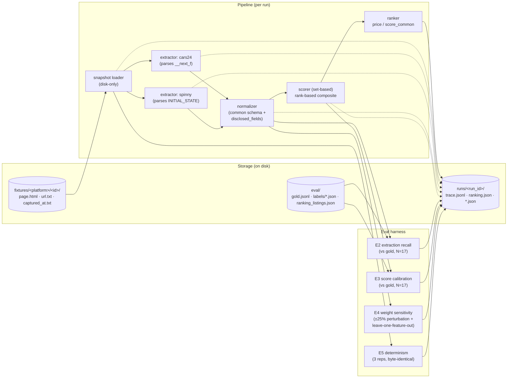

# Technical Appendix — Cars24 vs Spinny Competitive Intel

_Run id: `20260507T101410-3c6ec3`_

_Companion to [`../README.md`](../README.md). All methodology, per-feature breakdown, eval harness numbers, and limitations live here._

## 1. Methodology

**Pipeline.** Single explicit DAG, synchronous, deterministic at scoring/ranking. Source: `src/ci/pipeline.py`.

### Component map



Solid arrows = data flow; dotted arrows = trace records (every node logs input hash, output hash, latency to `trace.jsonl`).

**Extractors are JSON-parse-first.** Both platforms inject canonical listing data as inline JSON (Cars24 via Next.js streaming `__next_f` payloads; Spinny via `window.__INITIAL_STATE__` JS literal). The extractors parse that directly. There is **no LLM in the pipeline** — an earlier draft kept a placeholder `LLMClient` for a possible free-text inspection-narrative fallback, but since both platforms expose enough structured data on their listing pages, the placeholder was removed as dead code.

**Scoring is rank-based.** For each scoring dimension, listings are sorted (best→worst), assigned 1-indexed rank with tie averaging, and converted to a 0-100 score by linear interpolation: `100 × (n - rank) / (n - 1)`. The composite is a weight-sum across dimensions:

| dimension | weight | direction |
|---|---:|---|
| km_driven | 35 | lower is better |
| age_years | 25 | lower is better |
| owners | 25 | lower is better |
| accident_disclosed | 15 | none > minor > major |

**Why rank-based, not anchored bands?** Anchored bands baked an unjustifiable prior ("<20k km is excellent") into every score. Rank-based asks only "is A's km better than B's km?" — trivially answerable from the data without inventing thresholds. Trade-off: loses absolute magnitude (a 50k-km gap and a 2k-km gap can map to the same rank delta). Magnitude lives in the raw fields and is available for any post-hoc analysis.

**Common-set scoring is the *fair* comparison given pre-auth data asymmetry.** Cars24 has no per-listing certification tier and no per-listing accident-detail field; Spinny has both. Mixing platform-specific fields into the score would advantage Spinny on data-disclosure rather than condition. Cars24's platform-level no-accident promise is mapped to per-listing `accident_disclosed = none`. The reasoning behind these choices is in [`tradeoffs.md`](tradeoffs.md).

## 2. Per-feature rank breakdown

Each feature, raw value, and rank-score (0-100) for the 6 listings. Composite is the weight-sum. Rows in ranking order.

| listing | platform | price | km | age | own | accident | km_score | age_score | own_score | acc_score | composite |
|---|---|---:|---:|---:|---:|---|---:|---:|---:|---:|---:|
| `10096166769` | cars24 | ₹700,389 | 66,306 | 7 | 1 | none | 60.0 | 30.0 | 50.0 | 50.0 | **48.5** |
| `10126364760` | cars24 | ₹508,700 | 86,100 | 10 | 1 | none | 40.0 | 0.0 | 50.0 | 50.0 | **34.0** |
| `10067090111` | cars24 | ₹1,080,000 | 58,147 | 5 | 1 | none | 80.0 | 80.0 | 50.0 | 50.0 | **68.0** |
| `28476005` | spinny | ₹1,347,000 | 33,191 | 4 | 1 | none | 100.0 | 100.0 | 50.0 | 50.0 | **80.0** |
| `28198885` | spinny | ₹747,000 | 88,785 | 7 | 1 | none | 20.0 | 30.0 | 50.0 | 50.0 | **34.5** |
| `27839393` | spinny | ₹987,000 | 90,428 | 6 | 1 | none | 0.0 | 60.0 | 50.0 | 50.0 | **35.0** |

## 3. Pairwise win matrices

Pairwise comparison per feature. `1` = row beats column on this feature, `0` = loses, `½` = tie. Diagonal blank. The rank-score in §2 is mathematically the average of these wins (× scale).

### km_driven

| | `…6769` | `…4760` | `…0111` | `…6005` | `…8885` | `…9393` |
|---|---:|---:|---:|---:|---:|---:|
| `…6769` | — | 1 | 0 | 0 | 1 | 1 |
| `…4760` | 0 | — | 0 | 0 | 1 | 1 |
| `…0111` | 1 | 1 | — | 0 | 1 | 1 |
| `…6005` | 1 | 1 | 1 | — | 1 | 1 |
| `…8885` | 0 | 0 | 0 | 0 | — | 1 |
| `…9393` | 0 | 0 | 0 | 0 | 0 | — |

### age_years

| | `…6769` | `…4760` | `…0111` | `…6005` | `…8885` | `…9393` |
|---|---:|---:|---:|---:|---:|---:|
| `…6769` | — | 1 | 0 | 0 | ½ | 0 |
| `…4760` | 0 | — | 0 | 0 | 0 | 0 |
| `…0111` | 1 | 1 | — | 0 | 1 | 1 |
| `…6005` | 1 | 1 | 1 | — | 1 | 1 |
| `…8885` | ½ | 1 | 0 | 0 | — | 0 |
| `…9393` | 1 | 1 | 0 | 0 | 1 | — |

### owners

| | `…6769` | `…4760` | `…0111` | `…6005` | `…8885` | `…9393` |
|---|---:|---:|---:|---:|---:|---:|
| `…6769` | — | ½ | ½ | ½ | ½ | ½ |
| `…4760` | ½ | — | ½ | ½ | ½ | ½ |
| `…0111` | ½ | ½ | — | ½ | ½ | ½ |
| `…6005` | ½ | ½ | ½ | — | ½ | ½ |
| `…8885` | ½ | ½ | ½ | ½ | — | ½ |
| `…9393` | ½ | ½ | ½ | ½ | ½ | — |

### accident_disclosed

| | `…6769` | `…4760` | `…0111` | `…6005` | `…8885` | `…9393` |
|---|---:|---:|---:|---:|---:|---:|
| `…6769` | — | ½ | ½ | ½ | ½ | ½ |
| `…4760` | ½ | — | ½ | ½ | ½ | ½ |
| `…0111` | ½ | ½ | — | ½ | ½ | ½ |
| `…6005` | ½ | ½ | ½ | — | ½ | ½ |
| `…8885` | ½ | ½ | ½ | ½ | — | ½ |
| `…9393` | ½ | ½ | ½ | ½ | ½ | — |

## 4. Eval harness results

### E2 — Extraction quality (vs hand-labeled gold, N=17, independent of the ranking 6)

Gold dataset: 17 listings hand-labeled, all matching the same SX-petrol-automatic filter, all distinct from the 6 listings being ranked.

- field_recall (overall): `{'price': 1.0, 'km_driven': 1.0, 'age_years': 1.0, 'owners': 1.0}`
- per_platform: `{"cars24": {"price": 1.0, "km_driven": 1.0, "age_years": 1.0, "owners": 1.0}, "spinny": {"price": 1.0, "km_driven": 1.0, "age_years": 1.0, "owners": 1.0}}`

100% recall on the 4 score-bearing fields across all gold listings, both platforms. Self-consistency check (gold uses same rubric on same source JSON), not independent calibration. See limitations.

### E3 — Score calibration (vs gold, N=17)

- MAE (overall): `0.0`
- Spearman ρ (overall): `1.0`
- per_platform_MAE: `{"cars24": 0.0, "spinny": 0.0}`
- per_platform_ρ: `{"cars24": 1.0, "spinny": 0.9999999999999999}`

MAE = 0 by construction (gold uses same rubric on same source data). Useful as a regression guard for future runs.

### E4 — Weight sensitivity (Kendall's τ vs unperturbed ranking)

**±25% perturbation per dim:**

| dim direction | τ |
|---|---:|
| km_driven+ | 1.000 |
| km_driven- | 1.000 |
| age_years+ | 0.867 |
| age_years- | 0.867 |
| owners+ | 1.000 |
| owners- | 1.000 |
| accident_disclosed+ | 1.000 |
| accident_disclosed- | 1.000 |

**Leave-one-dim-out:**

| dim removed | τ |
|---|---:|
| km_driven | 0.600 |
| age_years | 0.867 |
| owners | 0.733 |
| accident_disclosed | 0.733 |

Readings:
- Ranking is **stable to ±25% weight perturbation** (τ ≥ 0.87).
- **km_driven has the strongest single influence** — removing it drops τ to 0.60. The other features stay 0.73–0.87. No single feature alone determines the ranking, but km matters most.

### E5 — Determinism

- 3 reps on `cars24/10142868769`: identical = `True`, distinct outputs = `1`
- Pipeline is byte-deterministic given fixed snapshots.

## 5. Disclosure asymmetry — side observation, not a ranking input

`disclosure_count` is **not** a scoring dimension. It does not affect the ranking in `README.md`. It is reported as a descriptive metric because the gap between the two platforms is large and structural — but it speaks to platform *positioning*, not to *which-listing-is-the-better-deal*. Anyone acting on the ranking should set it aside.

### The numbers

- Cars24: **4 of 17** condition-relevant fields exposed per listing (uniform across all 3 Cars24 listings in this sample).
- Spinny: **11-12 of 17** per listing.
- ~3× ratio. Concrete and observable, not constructed.

### What the gap means (positioning interpretation)

The ~13-field gap isn't evenly spread. Spinny exposes the *judgment-bearing* fields — inspection sub-ratings, repair statements, tier, accident boolean, market-price-delta. Cars24 exposes only metadata (price, km, year, insurance type) plus a platform-level promise.

So:
- **Cars24's product is "trust the platform — same warranty, same 140-pt promise on every car."** The buyer doesn't read condition specifics; the platform vouches.
- **Spinny's product is "read the report — here's exactly what was inspected, what was found, what tier this car is in."** The buyer self-serves.

Both are coherent strategies. They likely target different buyer segments (price-sensitive trust-the-brand vs informed read-the-paper-trail). **This is a signal about how each platform competes, not a signal about which listing is a better deal.**

### Why it's deliberately not in the ranking

Mixing disclosure breadth into the score would conflate "exposes more data" with "is in better condition". A Cars24 listing in objectively excellent mechanical shape with sparse disclosure should not be penalised for being on a platform that markets opacity-as-uniformity.

### 17 disclosure-eligible fields

A listing scores 1 per field if any non-null value is exposed pre-auth.

- `accident_history_detail`
- `inspection_per_section_ratings`
- `inspection_repair_statements`
- `tyre_condition_per_wheel`
- `service_history_records`
- `warranty_remaining_months`
- `noc_status`
- `rc_type`
- `insurance_type`
- `insurance_validity`
- `previous_use_type`
- `challan_status`
- `hypothecation_status`
- `inspection_photo_count`
- `per_listing_certification_tier`
- `buy_back_pricing`
- `market_price_delta`

The ~13-field gap isn't even spread — Spinny exposes the *judgment-bearing* ones (inspection ratings, repair statements, tier, market-price delta), not just metadata. That's the part that maps to *positioning*, not just *quantity*.

## 6. With a market corpus, this would be a different problem

The current pipeline is the small-N illustrative version. A serious version of the same product is not a hand-tuned rubric over 6 listings — it's a regression model over thousands.

### The approach at scale

1. **Collect a corpus** — 5,000+ listings of the target model (or several thousand each across many models), ideally with sale outcomes (final price, days-to-sale), but listing prices are workable as a proxy.
2. **Fit a hedonic regression** — `price = f(features)` where `features` includes everything the platforms expose: km, age, owners, variant, fuel, transmission, color, RTO/region, inspection findings (LLM-extracted severity for free-text), accident severity, dealer location, time-on-market, etc.
3. **Coefficients become weights, derived from market behavior, not priors.** The regression outputs the *market's revealed importance* of each feature.
4. **Per-listing deal score** = `expected_price (model.predict) / listed_price`. Above 1 = below market expectation = good deal. Below 1 = priced above market expectation.

### Why this is the right shape at scale

- **Categorical specs handle cleanly.** Variant, fuel, color enter as one-hot dummies. Their effect on price is *measured*, not guessed. The "diesel adds ₹70k" question becomes a coefficient, not a hand-pick.
- **Asymmetric data is OK.** Spinny's deeper inspection report becomes additional features in the regression for Spinny rows; Cars24 gets imputed values or platform-level dummies. The model learns each platform's predictive structure.
- **Eliminates almost every prior we currently have.** No band cutoffs, no per-feature weights, no need to filter heterogeneity out of the comparison set. Filtering is replaced by *controlling for* via regression.
- **Per-platform deal-score distributions over time** become the actual competitive intel signal — a shifted distribution week-over-week tells you each platform's pricing posture.

### What this exercise demonstrates instead

With N=6 ranking + N=17 gold and no transactional corpus, fitting a regression is overfit on contact. The honest small-N path is **match-then-compare**: tightly filter to listings that share the qualitative specs (same trim band, same fuel, same transmission), then rank-score on the remaining quantitative dims. That's what the current dataset does (Hyundai Creta, Delhi-NCR, SX trim line, petrol, automatic).

Both methods aim at the same thing — a price-to-condition signal that controls for spec heterogeneity. Match-then-compare controls by *exclusion*; hedonic regression controls by *modelling*. With more data, the second is strictly better.

### What a real product would look like

- Continuous ingestion of listings + outcomes from both platforms
- Weekly-refreshed regression with confidence intervals on coefficients
- Per-platform deal-score distributions plotted over time → the competitive intel signal
- LLM-as-judge pipeline for free-text inspection narrative, scored per-finding and plugged in as severity features
- Drift-detection eval — does the regression still fit, or has the market shifted?

That's a different scope. This project is the small-N illustrative version that demonstrates the architecture, the eval discipline, and the methodology — not the production-scale signal.

---

## 7. Tradeoffs journal

See [`tradeoffs.md`](tradeoffs.md) for the full journal. Headlines:

1. **Speculative schema vs real data.** Mid-build, fetched real listings and discovered the schemas were largely fictional. Pivoted to JSON-parse-first extraction. Rewrote 3 tasks.
2. **Gold-labeling on a deterministic pipeline.** E2/E3 against hand-labeled gold come out perfect by construction. Honest framing in the limitations section.
3. **Anchored bands → rank-based scoring.** Bands were defensible only via sensitivity analysis. Rank-based is defensible by construction ("is A's km better than B's km — yes"). Tradeoff: lost magnitude, gained groundedness.
4. **Tight scope filter (variant + fuel + transmission).** First ranking mixed petrol/diesel, manual/auto, and EX/SX/SX(O) — spec heterogeneity contaminated the price-to-condition ratio. Re-collected the dataset under a tight filter (SX-petrol-auto). Top-3 cleared up: all Cars24, by a consistent ratio margin. E4 km LOO τ moved from 0.33 to 0.60 (less overwhelming once trim/fuel/transmission heterogeneity removed).

## 8. Limitations

- **Trim line still spans SX / SX PLUS / SX (O).** These are different sub-trims of the SX family with their own MSRP differences. Tightening to a single sub-trim would shrink supply below the gold target; the SX-line filter is the closest workable compromise.

- **N=6 ranking.** Strategic conclusions are illustrative. Listings span 2016-2022 to demonstrate the method across the SX-petrol-auto sub-segment.
- **Rank-based scoring depends on the set composition.** Same listing in a different 6-set could rank differently. The composite is a relative-position score, not an absolute condition score.
- **km_driven has the strongest single influence on the ranking** (E4 LOO τ = 0.60; other features 0.73–0.87). Defensible given km is the strongest single predictor in used-car valuation, but worth surfacing.
- **E3 calibration is a self-consistency check**, not an independent eval. Gold uses the same rubric on the same JSON the extractor parses. True calibration would require holistic gut-rated scores or third-party valuation.
- **Cars24 platform-level no-accident promise is *modelled* as per-listing `accident_disclosed = none`.** Defensible mapping, not a per-listing extraction. Documented and acknowledged.
- **disclosure_count is binary per field.** A single boolean (Spinny `is_accidental: false`) counts the same as detailed exposure (per-section inspection sub-ratings). Measures *presence*, not *depth*.
- **Gold annotated by one annotator** (the author). No inter-rater data.
- **Snapshots are point-in-time.** Findings apply to vintage as recorded in `fixtures/<platform>/<id>/captured_at.txt`.

## 9. Reproducibility

```
uv run pytest                              # 55 tests
uv run python scripts/run_pipeline.py      # produces runs/<id>/ranking.json
```
Latest run: `runs/20260507T101410-3c6ec3/`
Per-fixture metadata: `fixtures/<platform>/<id>/{page.html, captured_at.txt, url.txt, extracted.json, normalized.json}`