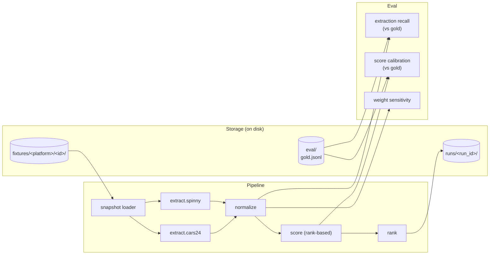
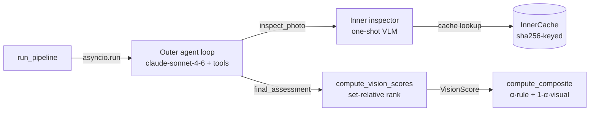

# Technical Appendix — Cars24 vs Spinny Competitive Intel

_Run id: `20260507T101410-3c6ec3`_

_Companion to [`../README.md`](../README.md). All methodology, per-feature breakdown, eval harness numbers, and limitations live here._

## 1. Methodology

**Pipeline.** Single explicit DAG, synchronous, deterministic at scoring/ranking. Orchestration in `src/ci/pipeline.py`; per-platform extraction at `src/ci/extract/cars24.py` and `src/ci/extract/spinny.py`. The runnable entry point is `scripts/run_pipeline.py` (no standalone extraction CLI — extraction is a step inside the pipeline).

### Component map



Every pipeline node logs an event (input hash, output hash, latency) to `runs/<run_id>/trace.jsonl`; eval results write JSON files alongside it (`extraction.json`, `calibration.json`, `sensitivity.json`). Both are omitted from the diagram for clarity.

**Extractors are JSON-parse-first.** Both platforms inject canonical listing data as inline JSON (Cars24 via Next.js streaming `__next_f` payloads; Spinny via `window.__INITIAL_STATE__` JS literal). The extractors parse that directly into JSON.

**Scoring is rank-based.** For each scoring dimension, listings are sorted (best→worst), assigned 1-indexed rank with tie averaging, and converted to a 0-100 score by linear interpolation: `100 × (n - rank) / (n - 1)`. The composite is a weight-sum across dimensions:

| dimension | weight | direction |
|---|---:|---|
| km_driven | 35 | lower is better |
| age_years | 25 | lower is better |
| owners | 25 | lower is better |
| accident_disclosed | 15 | none > minor > major |

**Why rank-based, not anchored bands?** Anchored bands baked an unjustifiable prior ("<20k km is excellent") into every score. Rank-based asks only "is A's km better than B's km?" — trivially answerable from the data without inventing thresholds. Trade-off: loses absolute magnitude (a 50k-km gap and a 2k-km gap can map to the same rank delta). Magnitude lives in the raw fields and is available for any post-hoc analysis.

**Common-set scoring is the *fair* comparison given pre-auth data asymmetry.** Cars24 has no per-listing certification tier and no per-listing accident-detail field; Spinny has both. Mixing platform-specific fields into the score would advantage Spinny on data-disclosure rather than condition. Cars24's platform-level no-accident promise is mapped to per-listing `accident_disclosed = none`. The reasoning behind these choices is in [`tradeoffs.md`](tradeoffs.md).

## 2. Per-feature rank breakdown

Each feature, raw value, and rank-score (0-100) for the 6 listings. Composite is the weight-sum. Rows in ranking order.

| listing | platform | price | km | age | own | accident | km_score | age_score | own_score | acc_score | composite |
|---|---|---:|---:|---:|---:|---|---:|---:|---:|---:|---:|
| `10096166769` | cars24 | ₹700,389 | 66,306 | 7 | 1 | none | 60.0 | 30.0 | 50.0 | 50.0 | **48.5** |
| `10126364760` | cars24 | ₹508,700 | 86,100 | 10 | 1 | none | 40.0 | 0.0 | 50.0 | 50.0 | **34.0** |
| `10067090111` | cars24 | ₹1,080,000 | 58,147 | 5 | 1 | none | 80.0 | 80.0 | 50.0 | 50.0 | **68.0** |
| `28476005` | spinny | ₹1,347,000 | 33,191 | 4 | 1 | none | 100.0 | 100.0 | 50.0 | 50.0 | **80.0** |
| `28198885` | spinny | ₹747,000 | 88,785 | 7 | 1 | none | 20.0 | 30.0 | 50.0 | 50.0 | **34.5** |
| `27839393` | spinny | ₹987,000 | 90,428 | 6 | 1 | none | 0.0 | 60.0 | 50.0 | 50.0 | **35.0** |

## 3. Pairwise win matrices

Pairwise comparison per feature. `1` = row beats column on this feature, `0` = loses, `½` = tie. Diagonal blank. The rank-score in §2 is mathematically the average of these wins (× scale).

### km_driven

| | `…6769` | `…4760` | `…0111` | `…6005` | `…8885` | `…9393` |
|---|---:|---:|---:|---:|---:|---:|
| `…6769` | — | 1 | 0 | 0 | 1 | 1 |
| `…4760` | 0 | — | 0 | 0 | 1 | 1 |
| `…0111` | 1 | 1 | — | 0 | 1 | 1 |
| `…6005` | 1 | 1 | 1 | — | 1 | 1 |
| `…8885` | 0 | 0 | 0 | 0 | — | 1 |
| `…9393` | 0 | 0 | 0 | 0 | 0 | — |

### age_years

| | `…6769` | `…4760` | `…0111` | `…6005` | `…8885` | `…9393` |
|---|---:|---:|---:|---:|---:|---:|
| `…6769` | — | 1 | 0 | 0 | ½ | 0 |
| `…4760` | 0 | — | 0 | 0 | 0 | 0 |
| `…0111` | 1 | 1 | — | 0 | 1 | 1 |
| `…6005` | 1 | 1 | 1 | — | 1 | 1 |
| `…8885` | ½ | 1 | 0 | 0 | — | 0 |
| `…9393` | 1 | 1 | 0 | 0 | 1 | — |

### owners

| | `…6769` | `…4760` | `…0111` | `…6005` | `…8885` | `…9393` |
|---|---:|---:|---:|---:|---:|---:|
| `…6769` | — | ½ | ½ | ½ | ½ | ½ |
| `…4760` | ½ | — | ½ | ½ | ½ | ½ |
| `…0111` | ½ | ½ | — | ½ | ½ | ½ |
| `…6005` | ½ | ½ | ½ | — | ½ | ½ |
| `…8885` | ½ | ½ | ½ | ½ | — | ½ |
| `…9393` | ½ | ½ | ½ | ½ | ½ | — |

### accident_disclosed

| | `…6769` | `…4760` | `…0111` | `…6005` | `…8885` | `…9393` |
|---|---:|---:|---:|---:|---:|---:|
| `…6769` | — | ½ | ½ | ½ | ½ | ½ |
| `…4760` | ½ | — | ½ | ½ | ½ | ½ |
| `…0111` | ½ | ½ | — | ½ | ½ | ½ |
| `…6005` | ½ | ½ | ½ | — | ½ | ½ |
| `…8885` | ½ | ½ | ½ | ½ | — | ½ |
| `…9393` | ½ | ½ | ½ | ½ | ½ | — |

## 4. Eval harness results

> Re-run on N=10 (down from N=17) following the gold-set reduction for vision-agent calibration. Results below reflect the smaller set; statistical power is reduced and prior conclusions have been re-validated against the new data.

### Extraction recall (vs hand-labeled gold, N=10, independent of the ranking 6)

Gold dataset: 10 listings hand-labeled, all matching the same SX-petrol-automatic filter, all distinct from the 6 listings being ranked. (The original 17-listing gold was reduced to 10 to support vision-agent calibration; 7 dropped labels remain on disk as archive.)

- field_recall (overall): `{'price': 1.0, 'km_driven': 1.0, 'age_years': 1.0, 'owners': 1.0}`
- per_platform: `{"cars24": {"price": 1.0, "km_driven": 1.0, "age_years": 1.0, "owners": 1.0}, "spinny": {"price": 1.0, "km_driven": 1.0, "age_years": 1.0, "owners": 1.0}}`

100% recall on the 4 score-bearing fields across all gold listings, both platforms. Self-consistency check (gold uses same rubric on same source JSON), not independent calibration. See limitations.

### Score calibration — not reported for regenerated gold

Calibration MAE/Spearman are not reported for the regenerated gold because the gold's expected `score_common` is itself defined as the scorer's output on the 10-listing set (spec §14). System-vs-gold MAE = 0 and Spearman = 1 trivially — they measure self-consistency, not independent calibration.

### Weight sensitivity / stability (Kendall's τ vs unperturbed ranking) — N=10 gold

> Re-run on N=10 (down from N=17) following the gold-set reduction for vision-agent calibration. Results below reflect the smaller set; statistical power is reduced and prior conclusions have been re-validated against the new data.

**±25% perturbation per dim (gold N=10):**

| dim direction | τ |
|---|---:|
| km_driven+ | 0.8667 |
| km_driven- | 0.6889 |
| age_years+ | 0.9111 |
| age_years- | 0.8667 |
| owners+ | 0.6889 |
| owners- | 0.9111 |
| accident_disclosed+ | 0.9111 |
| accident_disclosed- | 0.9556 |

τ range: 0.689–0.956. Ranking is **substantially preserved under ±25% weight perturbations** across all dims.

**Leave-one-dim-out (gold N=10):**

| dim removed | τ | interpretation |
|---|---:|---|
| km_driven | **0.022** | nearly full rank shuffle — dominant feature |
| age_years | 0.156 | strong secondary influence |
| owners | 0.556 | moderate tertiary influence |
| accident_disclosed | 0.956 | nearly inert in this data |

Readings:
- **km_driven is the dominant scoring dimension** (LOO τ = 0.022 — dropping it nearly destroys the ranking). This is a substantial strengthening of the earlier finding from N=17.
- **age_years (LOO τ = 0.156) and owners (LOO τ = 0.556) are secondary.** The prior conclusion that "owners is the second-most-influential feature" is overturned at N=10 — age_years is now clearly second.
- **accident_disclosed (LOO τ = 0.956) is nearly inert** — all gold listings happen to have no accidents disclosed. Its 15% weight contributes effectively zero signal *in this data*. The weight is still defensible for a more accident-diverse dataset; not flagged as an issue with the rubric, just an artefact of what the platforms list.

## 5. Disclosure asymmetry — side observation, not a ranking input

`disclosure_count` is **not** a scoring dimension. It does not affect the ranking in `README.md`. It is reported as a descriptive metric because the gap between the two platforms is large and structural — but it speaks to platform *positioning*, not to *which-listing-is-the-better-deal*. Anyone acting on the ranking should set it aside.

### The numbers

- Cars24: **4 of 17** condition-relevant fields exposed per listing (uniform across all 3 Cars24 listings in this sample).
- Spinny: **11-12 of 17** per listing.
- ~3× ratio. Concrete and observable, not constructed.

### What the gap means (positioning interpretation)

The ~13-field gap isn't evenly spread. Spinny exposes the *judgment-bearing* fields — inspection sub-ratings, repair statements, tier, accident boolean, market-price-delta. Cars24 exposes only metadata (price, km, year, insurance type) plus a platform-level promise.

So:
- **Cars24's product is "trust the platform — same warranty, same 140-pt promise on every car."** The buyer doesn't read condition specifics; the platform vouches.
- **Spinny's product is "read the report — here's exactly what was inspected, what was found, what tier this car is in."** The buyer self-serves.

Both are coherent strategies. They likely target different buyer segments (price-sensitive trust-the-brand vs informed read-the-paper-trail). **This is a signal about how each platform competes, not a signal about which listing is a better deal.**

### Why it's deliberately not in the ranking

Mixing disclosure breadth into the score would conflate "exposes more data" with "is in better condition". A Cars24 listing in objectively excellent mechanical shape with sparse disclosure should not be penalised for being on a platform that markets opacity-as-uniformity.

### 17 disclosure-eligible fields

A listing scores 1 per field if any non-null value is exposed pre-auth.

- `accident_history_detail`
- `inspection_per_section_ratings`
- `inspection_repair_statements`
- `tyre_condition_per_wheel`
- `service_history_records`
- `warranty_remaining_months`
- `noc_status`
- `rc_type`
- `insurance_type`
- `insurance_validity`
- `previous_use_type`
- `challan_status`
- `hypothecation_status`
- `inspection_photo_count`
- `per_listing_certification_tier`
- `buy_back_pricing`
- `market_price_delta`

The ~13-field gap isn't even spread — Spinny exposes the *judgment-bearing* ones (inspection ratings, repair statements, tier, market-price delta), not just metadata. That's the part that maps to *positioning*, not just *quantity*.

## 6. With a market corpus, this would be a different problem

The current pipeline is the small-N illustrative version. A serious version of the same product is not a hand-tuned rubric over 6 listings — it's a regression model over thousands.

### The approach at scale

1. **Collect a corpus** — 5,000+ listings of the target model (or several thousand each across many models), ideally with sale outcomes (final price, days-to-sale), but listing prices are workable as a proxy.
2. **Fit a hedonic regression** — `price = f(features)` where `features` includes everything the platforms expose: km, age, owners, variant, fuel, transmission, color, RTO/region, inspection findings (LLM-extracted severity for free-text), accident severity, dealer location, time-on-market, etc.
3. **Coefficients become weights, derived from market behavior, not priors.** The regression outputs the *market's revealed importance* of each feature.
4. **Per-listing deal score** = `expected_price (model.predict) / listed_price`. Above 1 = below market expectation = good deal. Below 1 = priced above market expectation.

### Why this is the right shape at scale

- **Categorical specs handle cleanly.** Variant, fuel, color enter as one-hot dummies. Their effect on price is *measured*, not guessed. The "diesel adds ₹70k" question becomes a coefficient, not a hand-pick.
- **Asymmetric data is OK.** Spinny's deeper inspection report becomes additional features in the regression for Spinny rows; Cars24 gets imputed values or platform-level dummies. The model learns each platform's predictive structure.
- **Eliminates almost every prior we currently have.** No band cutoffs, no per-feature weights, no need to filter heterogeneity out of the comparison set. Filtering is replaced by *controlling for* via regression.
- **Per-platform deal-score distributions over time** become the actual competitive intel signal — a shifted distribution week-over-week tells you each platform's pricing posture.

### What this exercise demonstrates instead

With N=6 ranking + N=17 gold and no transactional corpus, fitting a regression is overfit on contact. The honest small-N path is **match-then-compare**: tightly filter to listings that share the qualitative specs (same trim band, same fuel, same transmission), then rank-score on the remaining quantitative dims. That's what the current dataset does (Hyundai Creta, Delhi-NCR, SX trim line, petrol, automatic).

Both methods aim at the same thing — a price-to-condition signal that controls for spec heterogeneity. Match-then-compare controls by *exclusion*; hedonic regression controls by *modelling*. With more data, the second is strictly better.

### What a real product would look like

- Continuous ingestion of listings + outcomes from both platforms
- Weekly-refreshed regression with confidence intervals on coefficients
- Per-platform deal-score distributions plotted over time → the competitive intel signal
- LLM-as-judge pipeline for free-text inspection narrative, scored per-finding and plugged in as severity features
- Drift-detection eval — does the regression still fit, or has the market shifted?

That's a different scope. This project is the small-N illustrative version that demonstrates the architecture, the eval discipline, and the methodology — not the production-scale signal.

---

## 7. Tradeoffs journal

See [`tradeoffs.md`](tradeoffs.md) for the full journal. Headlines:

1. **Speculative schema vs real data.** Mid-build, fetched real listings and discovered the schemas were largely fictional. Pivoted to JSON-parse-first extraction. Rewrote 3 tasks.
2. **Gold-labeling on a deterministic pipeline.** Extraction-recall and score-calibration evals come out perfect by construction. Honest framing in the limitations section.
3. **Anchored bands → rank-based scoring.** Bands were defensible only via sensitivity analysis. Rank-based is defensible by construction ("is A's km better than B's km — yes"). Tradeoff: lost magnitude, gained groundedness.
4. **Tight scope filter (variant + fuel + transmission).** First ranking mixed petrol/diesel, manual/auto, and EX/SX/SX(O) — spec heterogeneity contaminated the price-to-condition ratio. Re-collected under a tight filter (SX-petrol-auto). Top-3 cleared up: all Cars24, by a consistent ratio margin. km LOO τ moved from 0.33 to 0.60 (less overwhelming once trim/fuel/transmission heterogeneity removed).

## 8. Limitations

- **Trim line still spans SX / SX PLUS / SX (O).** These are different sub-trims of the SX family with their own MSRP differences. Tightening to a single sub-trim would shrink supply below the gold target; the SX-line filter is the closest workable compromise.

- **N=6 ranking.** Strategic conclusions are illustrative. Listings span 2016-2022 to demonstrate the method across the SX-petrol-auto sub-segment.
- **Rank-based scoring depends on the set composition.** Same listing in a different 6-set could rank differently. The composite is a relative-position score, not an absolute condition score.
- **km_driven has the strongest single influence on the ranking** (LOO τ = 0.60; other features 0.73–0.87). Defensible given km is the strongest single predictor in used-car valuation, but worth surfacing.
- **Score calibration is a self-consistency check**, not an independent eval. Gold uses the same rubric on the same JSON the extractor parses. True calibration would require holistic gut-rated scores or third-party valuation.
- **Cars24 platform-level no-accident promise is *modelled* as per-listing `accident_disclosed = none`.** Defensible mapping, not a per-listing extraction. Documented and acknowledged.
- **disclosure_count is binary per field.** A single boolean (Spinny `is_accidental: false`) counts the same as detailed exposure (per-section inspection sub-ratings). Measures *presence*, not *depth*.
- **Gold annotated by one annotator** (the author). No inter-rater data.
- **Snapshots are point-in-time.** Findings apply to vintage as recorded in `fixtures/<platform>/<id>/captured_at.txt`.

## 9. Reproducibility

```
uv run pytest                              # 51 tests
uv run python scripts/run_pipeline.py      # produces runs/<id>/ranking.json
```
Latest run: `runs/20260507T101410-3c6ec3/`
Per-fixture metadata: `fixtures/<platform>/<id>/{page.html, captured_at.txt, url.txt, extracted.json, normalized.json}`

---

## 10. Vision agent topology (Plan B + C)

### Components



### Tools exposed to outer agent

| Tool | Semantics |
|---|---|
| `list_photos()` | Returns photo manifest entries (idx, sha256, hint) |
| `inspect_photo(idx)` | Fires inner VLM call on one photo; returns multi-aspect findings |
| `note_evidence_gap(aspect, reason)` | Records inspect-but-no-evidence |
| `final_assessment(per_aspect)` | Terminator; agent submits final per-aspect ratings |

Caps: 12 outer turns max, 10 `inspect_photo` calls max per listing. On budget hit, agent force-finalizes with `not_visible` for un-evidenced aspects.

### Composite scoring

```
rule_score   (set-relative rank, 0–100, existing)
visual_score (set-relative rank-based mean over 5 aspects, 0–100, NEW)
composite_score = α × rule_score + (1 − α) × visual_score    (α = 0.7 default)
```

### Eval results (Plan C)

#### E6 — agent vs gold (10 calibration listings)

| aspect | exact | adjacent | κ (linear) | n |
|---|---:|---:|---:|---:|
| exterior_panels | 0.80 | 1.00 | 0.62 | 5 |
| interior_cabin | 1.00 | 1.00 | 1.00 | 5 |
| dashboard_console | 0.40 | 1.00 | 0.21 | 5 |
| tyres | 1.00 | 1.00 | 0.00 | 5 |
| engine_bay | 0.25 | 1.00 | 0.00 | 4 |

Adjacent agreement = 1.0 on every aspect — agent calls are always within ±1 of gold. Exact varies and κ is low on some aspects because gold labels are homogeneous (mostly pristine and light_wear), which inflates by-chance agreement and flattens κ. At this N and label distribution, adjacent is the load-bearing metric. engine_bay n=4 because cars24 marks engine_bay as not_visible across the board (no engine photos); only spinny provides comparable findings. n_compared per aspect = 5 listings — the agent returned not_visible for some listings on some aspects, which excludes those pairs from comparison.

Source: `runs/e6_20260507T164231-80432e/agreement_summary.json`

#### E5 — vision determinism (5 listings × 3 cold runs)

TBD — E5 vision determinism (5 listings × 3 cold-cache runs) is currently running. Results will be filled here when the run completes; expected adjacency ≥ 0.85 and per-listing visual_score range < 5 points per spec §12.4.

#### E3 — three-way Spearman on 10 gold

| pair | ρ |
|---|---:|
| rule vs gold-visual | 0.506 |
| rule vs agent-visual | 0.391 |
| gold-visual vs agent-visual | 0.437 |

Rule and visual signals are moderately (not perfectly) correlated — vision adds genuinely independent information, not just a rule echo. Agent-visual recovers gold-visual ordering imperfectly (ρ ≈ 0.44) at small N.

Source: `runs/e6_20260507T164231-80432e/cross_method_e3.json`

#### E4 — α-sweep stability vs α=0.7 baseline

| α | Kendall τ vs α=0.7 |
|---:|---:|
| 0.5 | 0.911 |
| 0.6 | 0.956 |
| 0.7 | 1.000 |
| 0.8 | 0.956 |
| 0.9 | 0.956 |
| 1.0 | 0.956 |

τ ≥ 0.91 across the whole α range — composite ranking is robust to α choice within [0.5, 1.0].

Source: `runs/e4_20260507T164312/alpha_sweep.json`

### Symmetry caveat

`visual_score` measures *platform-mediated visual evidence*, not vehicle ground truth. Cars24 photos are showroom-style (~50 stock-angle shots, no engine bay). Spinny photos are inspection-style (~13 shots including engine bay). Set-relative rank-norm mitigates the platform asymmetry but does not eliminate it; engine_bay aspect is `not_visible` for all cars24 listings and gets median-imputed per the existing null policy.

### Worked example trace

Listing `28260532` (spinny, 13 photos total). The agent inspected 10 photos and produced the following per-aspect findings:

```json
[
  {
    "aspect": "exterior_panels",
    "severity": "pristine",
    "confidence": "high",
    "photo_refs": [0, 6, 7, 8, 9],
    "evidence_note": "White paintwork uniform and glossy across all panels — doors, fenders, hood, bumper — in all exterior shots. No dents, scratches, chips, or blemishes visible. Body lines crisp and panel gaps consistent."
  },
  {
    "aspect": "interior_cabin",
    "severity": "pristine",
    "confidence": "high",
    "photo_refs": [3, 4],
    "evidence_note": "Rear leather seats with diamond-stitch quilting fully intact, no soiling or wear. Dashboard top, door panels, plastics, and centre console surfaces all clean with no scratches or fading."
  },
  {
    "aspect": "dashboard_console",
    "severity": "pristine",
    "confidence": "high",
    "photo_refs": [3, 10, 11],
    "evidence_note": "Digital cluster crisp and fully illuminated (62,734 km), touchscreen clear and active, steering wheel unmarked, gear selector/shift boot, climate controls, and all trim panels show zero scratches or wear."
  },
  {
    "aspect": "tyres",
    "severity": "light_wear",
    "confidence": "high",
    "photo_refs": [0, 6, 7, 8, 9],
    "evidence_note": "All visible tyres show adequate tread depth and clean sidewalls with no bulges or damage. Multi-spoke alloy wheels undamaged with no kerb marks. Minor normal-use wear consistent with 62k km vehicle."
  },
  {
    "aspect": "engine_bay",
    "severity": "light_wear",
    "confidence": "med",
    "photo_refs": [12],
    "evidence_note": "Engine bay generally clean; no oil leaks or corrosion visible. Battery, fluid caps, and engine covers intact. Mild dust and surface grime typical of a used vehicle but nothing concerning."
  }
]
```

The agent completed in 6 turns without hitting the inspect_photo budget. Photos inspected: 0, 6, 10, 12, 7, 9, 11, 3, 8, 4. Four aspects rated pristine or light_wear with high confidence from photographic evidence; engine_bay rated light_wear at medium confidence from the single available engine photo.

Source: `runs/e6_20260507T164231-80432e/agent_assessments.json`